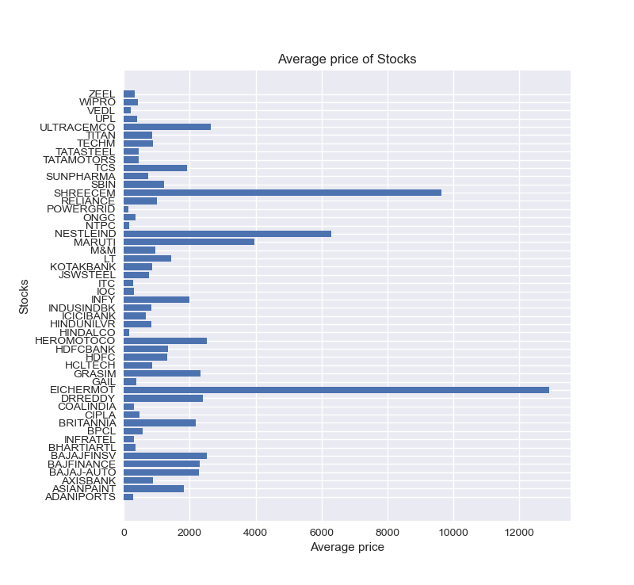
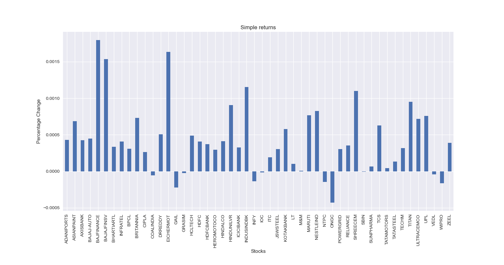
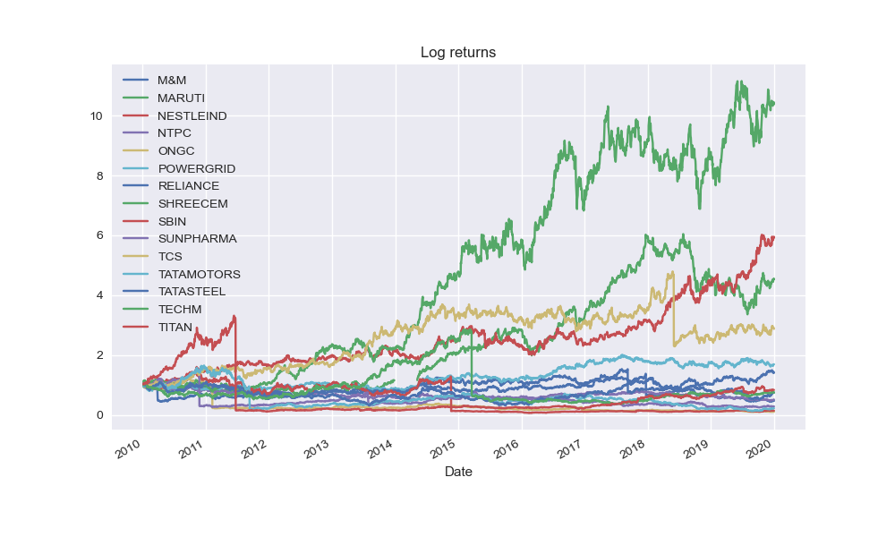
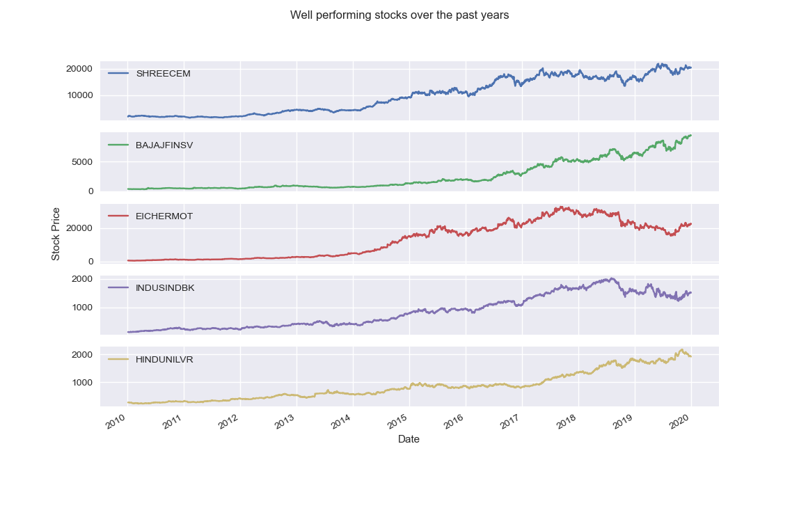
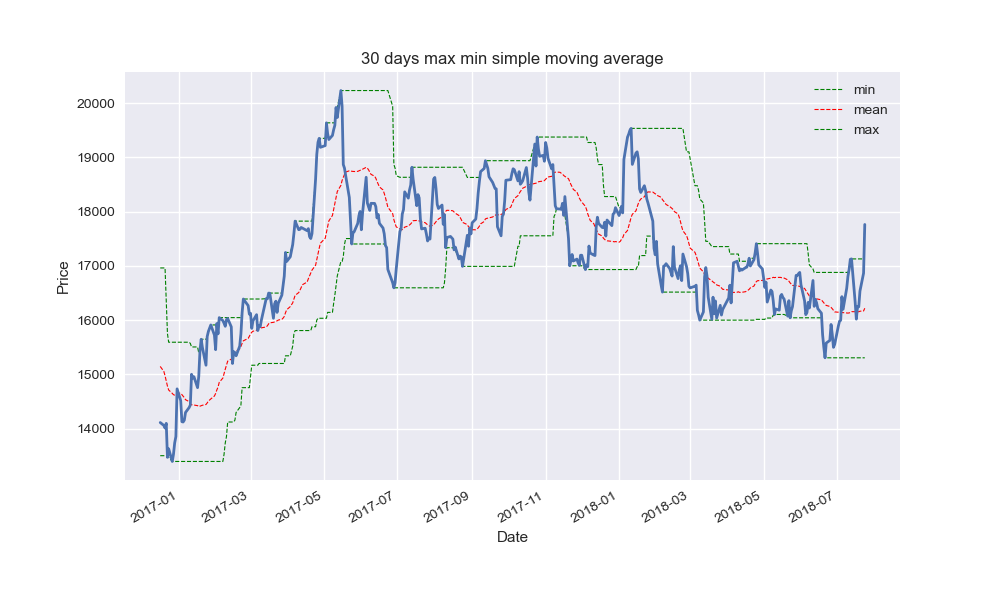
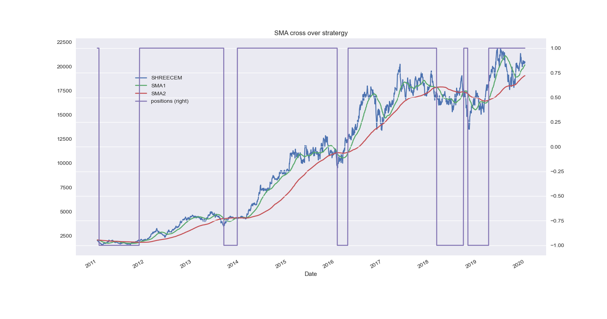
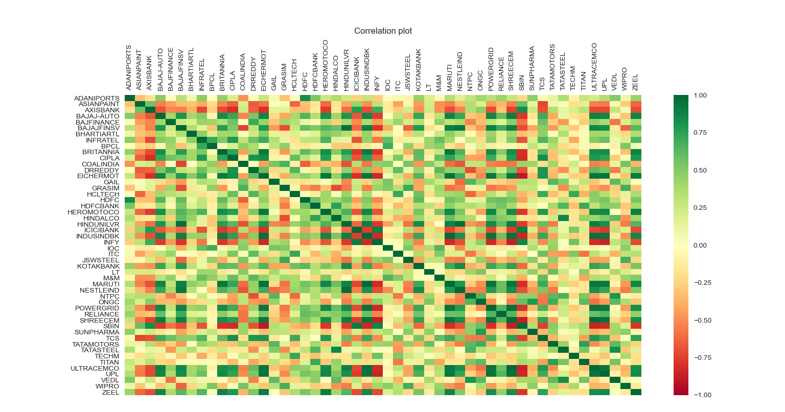
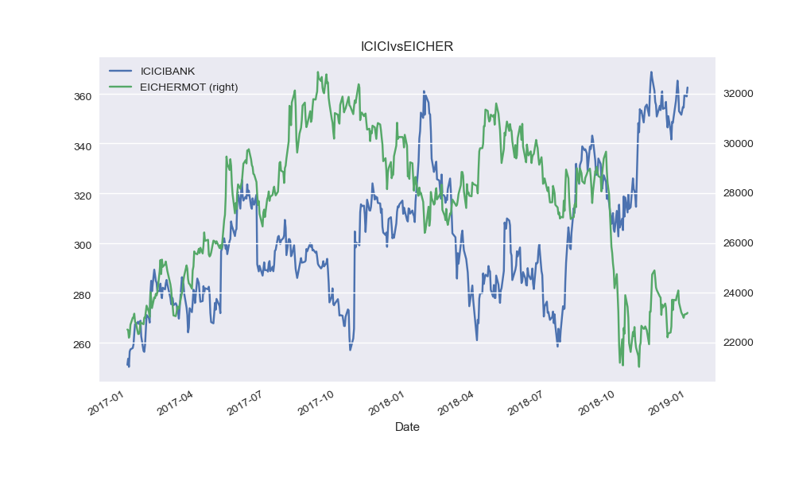

# Stock data analysis with python

This project explores the 50 stocks data listed in the NIFTY 50 index of National stock exchange.  


### Prerequisites

* Python 3.6.x

#### libraries required

* Pandas
* Numpy
* nsepy 
* BeautifulSoup
* Matplotlib

run below command to install all required libraries

```bash
    pip install requirements.txt
```

### Files 

```bash
    get_data.py
```

This file holds the code to pull the tickers data from Nifty50 wikipedia page using web scraping and save all the 50 tickers of Nifty 50 index into a pickle file for later use.


```python
    data = requests.get("https://en.wikipedia.org/wiki/NIFTY_50")
    soup = bs.BeautifulSoup(data.text, 'lxml')
```


After pulling all the data closing price for each ticker data is combined into a single csv file


```bash
    analysis.py
```

Deriving insight from the data is done in analysis.py.

### Finding stocks with good performance over the years

Plot of average price over the years for each ticker.


we can clearly see there are some companies whose stock price are much higher relative to others

### Simple returns

Percentage change is a mathematical concept that represents the degree of change over time, it also known as the simple returns in financial context.
Average simple returns plot represents how the stock has perfomed over the years since it had an IPO.



Above plot shows some companies whose simple returns are negative which simply means an investment made in that stock would have been a bad choice in today's date.

### Log returns

Log returns are used to reduce the variation of the time series data making it smoother and easier to visualize, it is now much better to spot performance of a stock.

Log returns plot of few Stocks



Considering all the above scenarios there were some stocks which caught my eye, as they were representing a good uptrend and less volatality.

Plot of selected stocks.



### Rolling statistics:

Simple moving average (SMA) is one the most popular indicator in the world of trading, it is used to make calls whether to buy or sell stocks and when.
The below plot shows maximum,minimum and mean SMA for the stock of Shree cements Ltd.
SMA can act as support line and resistance line.



### SMA cross over strategy:

A decades old trading stratergy based on technical analysis is about using 2 moving averages, a short period SMA and a longer period SMA.
The strategy says trader should go long on a stock if short SMA is sbove the longer SMA and it's also true for the opposite case.
Below plot represents the SMA cross over stratergy.



The secondary y axis on right side represents the position you must hold, 1 for buy and hold -1 for sell.


### Correlation:

Many indicators in combination with SMA and other factors can be used to predict the movement of a stock, previous patterns made by the stock can be analyzed for movement prediction. Believe it or not these stocks of the companies has some kind of impact on one another to some extent, movement in some company's stocks can also be used as an indicator to predic movement of a target stock.  

Lets check it by plotting the Correlation matrix from all the 50 companies.



It can be observed that there some companies which are strongly correlated with each other, some has negative and some has positive correlation.


Plot of two negativelty correlated companies.




